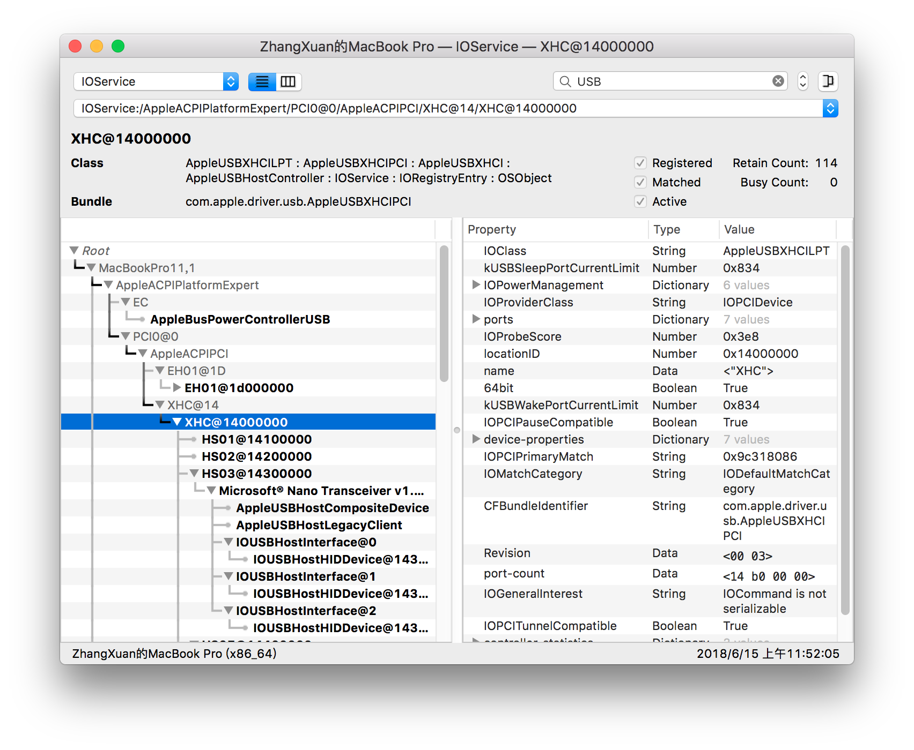
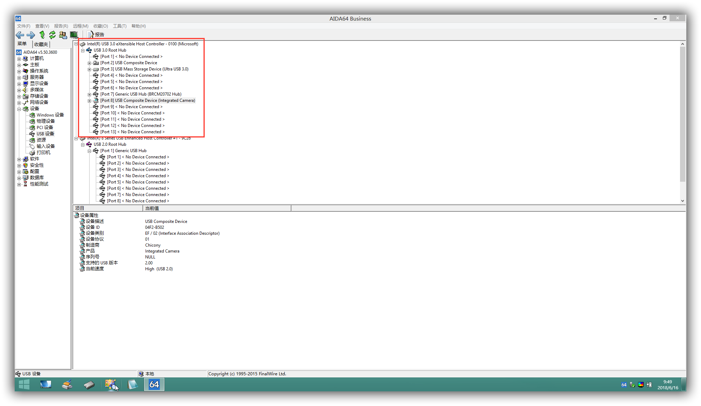
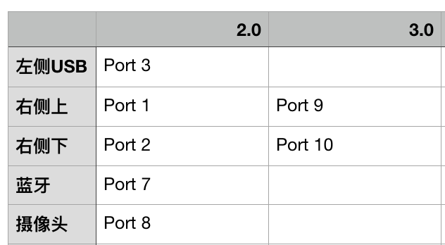
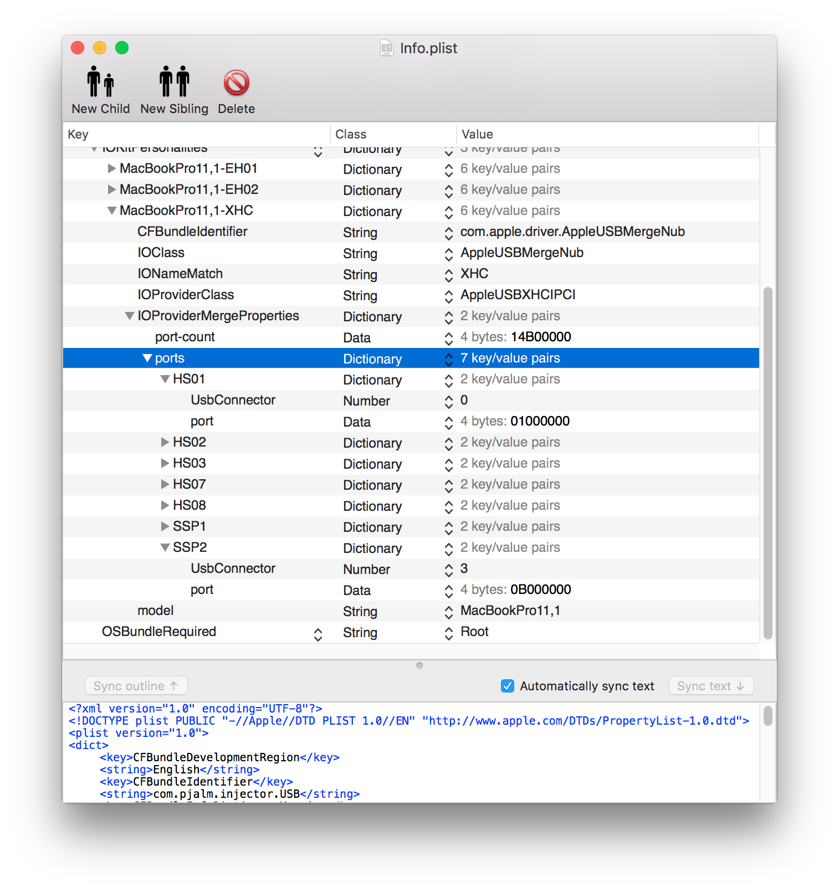
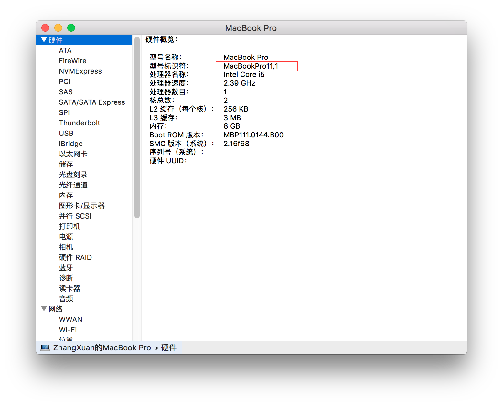
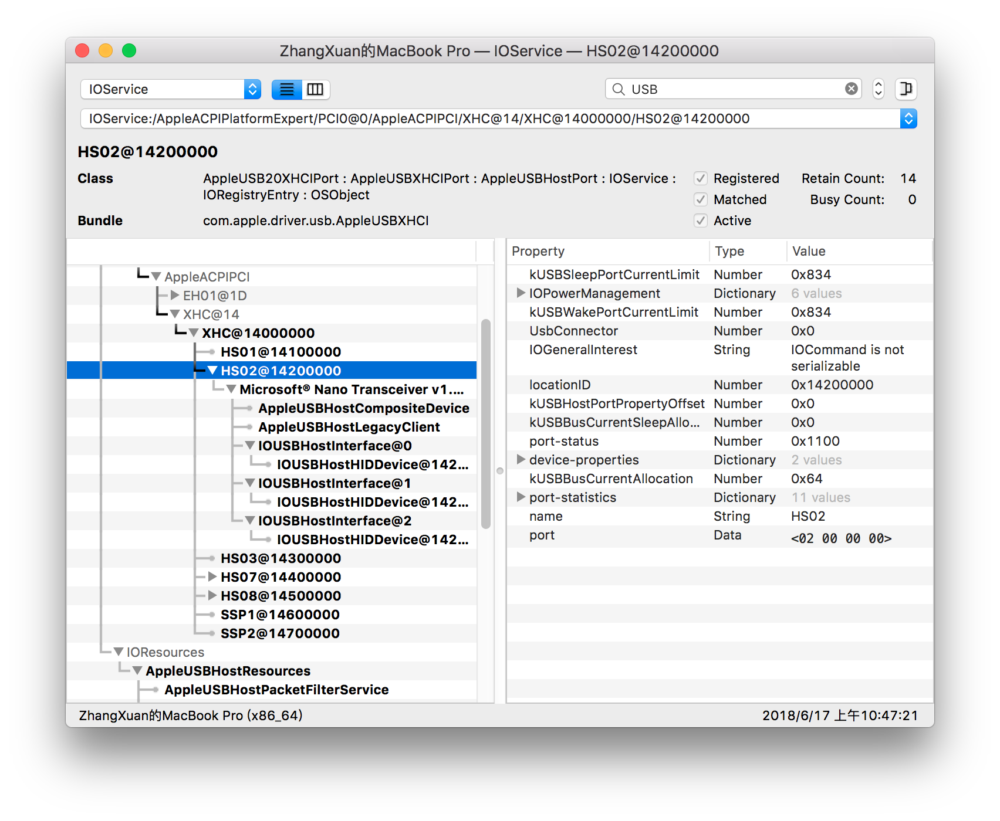

# Hackintosh USB注入
通常在黑苹果的过程中，各位的USB端口总会出现莫名奇妙的故障，自macOS10.11开始USB端口限制开始盛行，导致USB设备有的端口无法使用，甚至USB3.0的设备无法使用。

通过一系列的操作和方式与方法的研究通过DSDT或者Kext都可以有效的搞定USB端口的问题。

因Hotpatch的诞生hackintosh更加的可以达到完美的情况，Hotpatch需要搭配USBInjectAll.kext，个人是不喜欢同时需要SSDT 和Kext都需要使用的情况下才能使用的。 

通过制作个人自己的设备USB描述无需SSDT即可使用，当然台式机很完美的情况下不需要DSDT肯定一个Kext即可搞定。

步骤：
* 检查USB控制器名称。

* 通过Windows检查所有USB端口的使用情况，并且记下Port号

* EFI分区加载USBInjectAll.kext

* 备用软件：Plistedit、IORegistryExplorer

* USB.kext

### 检查USB控制器名称

通过IORegistryExplorer 可以查看当前USB控制器在macOS中的名称，PC经常会出现XHCI、XHC，白苹果默认XHC。


如果你的USB控制器为XHC即可略过下面的操作：<br>
修改本机USB控制器名称通过 Clover ACPI Patches修改：
``` plist
<key>Comment</key>
<string>XHCI to XHC </string>
<key>Find</key>
<data>
WEhDSQhf
</data>
<key>Replace</key>
<data>
WEhDXwhf
</data>
```
当然了也有手工党需要在Clover中直接进行修改
``` plist 
Comment
XHCI to XHC
Find:
58484349 085F
Replace:
5848435F 085F
```
效果图

<center>图 1-1</center>

### 通过Windows检查所有USB端口的使用情况，并且记下Port号


<center>图 1-2</center>
如图 1-2 所示，因intel至8系列之后所有的USB设备全部挂载XHC控制器，EH控制器已无USB设备产生，所以我们重点针对XHC来进行记录。

* USB2.0 设备：检查机器所有的USB2.0端口，插入USB2.0或者3.0设备并且记录下当前USB端口位置和Port。

* USB3.0 设备：检查机器的USB3.0端口，同时准备USB3.0设备和USB2.0设备，插入USB2.0设备记录下USB2.0挂载的端口位置，然后插入USB3.0设备记录下USB设备挂载端口位置。


<center>图1-3</center>
如图1-3 所示我的所有USB设备涵盖了 7个USB端口，远远低于macOS限制15个端口。

### EFI分区加载USBInjectAll.kext

进入macOS并且挂载EFI并且放入USBInjectAll.Kext驱动。

打开USB.kext的plist配置。


图中可以看到已经针对性的做了一定的配置来开始针对配置来做记录：

* MacBookPro11,1-XHC：此条记录针对你的机型名称来修改。

* IONameMatch：根据你的控制器名称进行修改，如果你没有Patch那么就是XHCI或者XHC，查看个人所需，如果控制器名称不同导致失效无法使用。

* Port-count：最大端口号，也就是你最后一个设备的端口号。

* HS01、HS02、HS03、HS07、HS08、SSP1、和SSP2，这写名称是可以定义的，还是根据你记录Windows平台下所查询到的端口来进行更改，也可自定义，多了删除少了增加。

* UsbConnector：0、3、255三种类型值。
    * 0：USB2.0设备
    * 3：USB3.0设备
    * 255：特殊设备，通常用于摄像头与蓝牙

* Port：端口值这个可以通过IOReg来进行查看，这也就是为什么要注入USBInjectAll.kext驱动。


<center>图1-4</center>
如图1-4所示HS02设备右侧详细信息里面最下面的Port中：02000000就是Port值，也就是我们最终做驱动填入的Port值。


